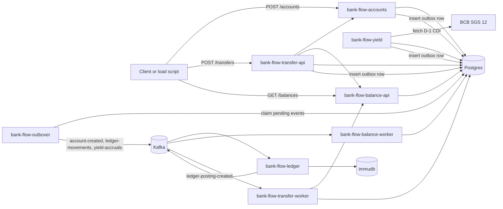

# Bank Flow Backend

Bank Flow is a study project for a banking backend built with Spring Boot, Kafka, Postgres and immudb. The repository models account opening, transfers, double-entry ledger posting, balance projection and a centralized transactional outbox publisher.

The project is intended to be open source. New contributors should be able to run the stack locally, understand each service boundary and submit focused changes without reverse-engineering the whole codebase.

## Repository Status

This is not production banking software. It is a learning and architecture project. Treat APIs, schemas and event contracts as evolving unless they are explicitly documented as stable.

The repository is structured to accept external contributions. Start with [CONTRIBUTING.md](CONTRIBUTING.md), keep pull requests focused, and update service READMEs whenever API, event, setup or operations behavior changes.

License note: choose and add a project license before a public release if this repository will be distributed as open source.

## Services

| Service | Runtime | Port | Main responsibility |
| --- | --- | --- | --- |
| `bank-flow-accounts` | Spring Boot | `8084` | Creates digital accounts and records `account-created` events in the central outbox. |
| `bank-flow-outboxer` | Spring Boot | `8088` | Publishes pending outbox events from Postgres to Kafka. |
| `bank-flow-yield` | Spring Boot | `8089` | Closes D-1 CDI yield, stores the rate used and records yield accrual events in the central outbox. |
| `bank-flow-transfer-api` | Spring Boot | `8083` | Receives transfer requests, PSP webhooks and external inbound transfer webhooks. |
| `bank-flow-transfer-worker` | Spring Boot | `8086` | Consumes ledger posting confirmations and completes transfers after ledger posting. |
| `bank-flow-ledger` | Spring Boot | `8085` | Maintains double-entry ledger state in immudb and publishes posting events. |
| `bank-flow-balance-api` | Spring Boot | `8082` | Exposes balances, statements and account holds. |
| `bank-flow-balance-worker` | Spring Boot | `8087` | Projects ledger postings into balances and statements. |

Only `bank-flow-ledger` owns the numeric accounting `account_id`. Public APIs and cross-service contracts use `digital_account_id`.

## Architecture



The outbox pattern is centralized:

- Producer services write business data and an outbox row in the same Postgres transaction.
- `bank-flow-outboxer` is the only service that claims outbox rows and publishes to Kafka.
- Existing producer services no longer run local outbox publishers.

## Event Topics

| Topic | Producer | Consumers | Key |
| --- | --- | --- | --- |
| `account-created` | `bank-flow-outboxer`, from accounts outbox rows | `bank-flow-ledger` | `digital_account_id` |
| `ledger-movements` | `bank-flow-outboxer`, from transfer outbox rows | `bank-flow-ledger` | `source_digital_account_id` |
| `ledger-reversals` | external scripts or tools | `bank-flow-ledger` | `original_external_id` |
| `yield-accruals` | `bank-flow-outboxer`, from yield outbox rows | `bank-flow-ledger` | `digital_account_id` |
| `ledger-posting-created` | `bank-flow-ledger` | `bank-flow-balance-worker`, `bank-flow-transfer-worker` | `external_id` |

Kafka topics are created by the `kafka-init` service in `docker-compose.yaml`. Each main topic has a `.DLT` companion topic.

## Local Requirements

- Java 21
- Docker and Docker Compose
- Bash-compatible shell
- Optional: Python 3 for load scripts
- Optional: k6 for HTTP load tests
- Optional: Helm and Minikube for Kubernetes work

Each Spring project ships its own Gradle wrapper, so a system Gradle installation is not required.

## Start Dependencies

From the repository root:

```bash
docker compose up -d db kafka kafka-init kafka-ui immudb
```

The Makefile also exposes shortcuts for local and Kubernetes workflows:

```bash
make compose-up          # build images and start infra + apps with Docker Compose
make compose-up-infra    # start only Postgres, Kafka, Kafka UI and immudb
make k8s-deploy          # build images, load them into Minikube and apply manifests with kubectl
make k8s-status          # show pods, services, HPA, PDB and KEDA ScaledObjects
make k6-smoke            # short low-rate E2E k6 smoke test
make k6-heavy            # heavy E2E k6 load test
```

Local endpoints:

| Component | URL or address |
| --- | --- |
| Postgres | `localhost:5432`, database `bank_flow`, user `myuser`, password `mysecretpassword` |
| Kafka | `localhost:9092` |
| Kafka UI | `http://localhost:8081` |
| immudb | `localhost:3322` |

## Run The Applications

Run each command in a separate terminal:

```bash
cd bank-flow-outboxer && ./gradlew bootRun
cd bank-flow-yield && ./gradlew bootRun
cd bank-flow-accounts && ./gradlew bootRun
cd bank-flow-ledger && ./gradlew bootRun
cd bank-flow-balance && ./gradlew :api:bootRun
cd bank-flow-balance && ./gradlew :worker:bootRun
cd bank-flow-transfer && ./gradlew :api:bootRun
cd bank-flow-transfer && ./gradlew :worker:bootRun
```

Start `bank-flow-outboxer` before creating accounts or transfers in a fresh database, because it owns the `outboxer.outbox_events` table migration.

## Smoke Test

Create an account:

```bash
curl -s -X POST http://localhost:8084/accounts \
  -H "Content-Type: application/json" \
  -H "Idempotency-Key: account-001" \
  -d '{
    "fullName": "Maria Silva",
    "documentNumber": "35225454860",
    "email": "maria@example.com",
    "motherName": "Ana Silva",
    "socialName": "Maria",
    "phoneNumber": "+5511999999999",
    "birthDate": "18-12-1996",
    "address": "Rua Teste, 123",
    "isPoliticallyExposed": false
  }'
```

Query a balance:

```bash
curl -s http://localhost:8082/balances/{digital_account_id}
```

For end-to-end traffic, use:

```bash
python3 scripts/orchestrate_accounts_transfers.py --accounts 3 --max-between-transfers 10
```

## Tests

Run all currently documented service tests:

```bash
cd bank-flow-accounts && ./gradlew test
cd ../bank-flow-outboxer && ./gradlew test
cd ../bank-flow-yield && ./gradlew test
cd ../bank-flow-ledger && ./gradlew test
cd ../bank-flow-balance && ./gradlew test
cd ../bank-flow-transfer && ./gradlew test
```

Some integration tests may require Docker because they use external infrastructure or Testcontainers.

## Project Layout

```text
bank-flow-accounts/    Account API and account outbox producer
bank-flow-outboxer/    Central outbox publisher
bank-flow-yield/       CDI yield service
bank-flow-transfer/    Transfer API, worker and shared module
bank-flow-ledger/      Accounting ledger service
bank-flow-balance/     Balance API, worker and shared module
docs/                  Architecture notes and deployment learnings
scripts/               Local orchestration, load tests and immudb setup helpers
observability/         Prometheus, Grafana, Loki and Tempo configs
kong-configs/          Gateway examples
```

## Kubernetes

Each deployable service has a Helm chart under its service directory.

Example:

```bash
helm upgrade --install bank-flow-accounts bank-flow-accounts/k8s
helm upgrade --install bank-flow-outboxer bank-flow-outboxer/k8s
helm upgrade --install bank-flow-yield bank-flow-yield/k8s
helm upgrade --install bank-flow-balance bank-flow-balance/k8s
helm upgrade --install bank-flow-ledger bank-flow-ledger/k8s
helm upgrade --install bank-flow-transfer bank-flow-transfer/k8s
```

Kubernetes and observability notes live in:

- [docs/deploy-kubernetes-minikube.md](docs/deploy-kubernetes-minikube.md)
- [docs/kubernetes-autoscaling-disruption.md](docs/kubernetes-autoscaling-disruption.md)
- [docs/aprendizados-deploy-kubernetes-minikube.md](docs/aprendizados-deploy-kubernetes-minikube.md)
- [docs/aprendizados-kubernetes-observabilidade.md](docs/aprendizados-kubernetes-observabilidade.md)

## Observability

Run the local observability stack:

```bash
docker compose -f docker-compose.observability.yml up -d
```

| Tool | URL |
| --- | --- |
| Grafana | `http://localhost:3000` |
| Prometheus | `http://localhost:9090` |
| Loki | `http://localhost:3100` |
| Tempo | `http://localhost:3200` |

Deploy dashboards from each service-owned `dashboards/` directory:

```bash
scripts/grafana/deploy_dashboards.sh
```

Defaults:

```text
GRAFANA_URL=http://localhost:3000
GRAFANA_USER=admin
GRAFANA_PASSWORD=admin
```

You can use `GRAFANA_TOKEN` instead of user/password. Dashboards provisioned by
Grafana files are left in place; the script deploys service-owned dashboards via
the Grafana API.

The global dashboards are intentionally split by operating question:

| Dashboard | Purpose |
| --- | --- |
| `Bank Flow Service Health` | Target availability, health probes, uptime and restarts. |
| `Bank Flow Golden Signals` | HTTP request rate, error ratio, latency, JVM and database pool signals by service. |
| `Bank Flow Layered Operations` | Layer view for HTTP, Kafka, outbox, database, business flow and JVM infrastructure. |
| `Bank Flow E2E Flow` | Business flow from transfer to ledger to balance. |
| `Bank Flow E2E Tracing` | Trace context coverage across HTTP, outbox and Kafka consumers. |
| `Bank Flow Service Dependencies` | Service graph metrics from Tempo, including service to service calls, latency, errors and throughput. |

Service-owned dashboards live under each `bank-flow-*/dashboards/` directory and are meant for drill-down after a global dashboard identifies the affected service.

Grafana alert rules are provisioned from:

```text
observability/grafana/provisioning/alerting/bank-flow-alerts.yml
```

Provisioned alerts:

| Alert | Initial threshold |
| --- | --- |
| Service down | `up == 0` for 2 minutes. |
| HTTP 5xx high | 5xx ratio above 5% for 5 minutes. |
| HTTP p95 latency high | p95 above 1 second for 5 minutes. |
| Kafka consumer lag high | lag above 100 messages for 5 minutes. |
| DLQ records detected | any new DLQ record in 5 minutes. |
| Outbox oldest pending high | oldest pending event above 120 seconds for 3 minutes. |
| Balance projection lag high | projection lag above 300 seconds for 5 minutes. |
| Transfers stuck in intermediate status | oldest intermediate transfer above 300 seconds for 5 minutes. |

After changing alert provisioning files, restart Grafana so it reloads the rules:

```bash
docker compose -f docker-compose.observability.yml restart grafana
```

Notification delivery is configured in Grafana through Contact points and Notification policies. The repository provisions the rules; each environment should choose its own Slack, email, webhook or incident-management destination.

All Spring services expose:

```text
/actuator/health
/actuator/metrics
/actuator/prometheus
```

### End-to-End Tracing

Tracing uses W3C context propagation through the `traceparent` header. For a
transfer, the root trace is created by `POST /transfers` unless the caller
already sends a `traceparent` header. If the caller sends one, the service keeps
the caller-provided `trace_id`; otherwise Spring creates a new one.

Example:

```http
traceparent: 00-44444444444444444444444444444444-1111111111111111-01
```

In that header, the `trace_id` is:

```text
44444444444444444444444444444444
```

The intended transfer trace is:

```text
POST /transfers
  -> bank-flow-accounts lookups
  -> bank-flow-balance-api hold creation
  -> PSP payment request or mock PSP pending state
  -> PSP webhook
  -> transfer outbox row
  -> bank-flow-outboxer Kafka publish
  -> bank-flow-ledger consume ledger-movements
  -> bank-flow-ledger publish ledger-posting-created
  -> bank-flow-transfer-worker complete transfer
  -> bank-flow-balance-api hold capture
  -> bank-flow-balance-worker project ledger posting
```

The PSP part is asynchronous. With the local mock PSP, `POST /transfers` usually
creates a transfer in `PSP_PENDING`; the later `POST /webhooks/psp/transfers`
continues the business flow. Real PSPs often call back without the original
HTTP tracing header, so the transfer service stores the original `traceparent`
on the transfer row and resumes that trace when processing the webhook. Without
that persisted context, Tempo would show a second trace that starts at the
webhook, for example:

```text
webhook -> outboxer -> ledger -> transfer-worker -> balance-api -> balance-worker
```

That sequence means the technical callback trace was visible, but it was not
linked back to the original `POST /transfers` trace. New transfers created after
the tracing migration should keep the same `trace_id` across the webhook and
Kafka path.

Trace context is also persisted in the central outbox:

- `outboxer.outbox_events.traceparent`
- `outboxer.outbox_events.tracestate`

Kafka events published by the outboxer carry these headers:

- `traceparent`
- `tracestate`, when present

Kafka listener factories for `bank-flow-ledger`, `bank-flow-transfer-worker`
and `bank-flow-balance-worker` explicitly enable observation so consumers create
spans in Tempo instead of only forwarding headers.

To find the trace for a transfer, query the transfer row or the outbox row:

```sql
SELECT transfer_id, psp_payment_id, traceparent
FROM transfer.transfers
WHERE transfer_id = '<transfer_id>';
```

```sql
SELECT aggregate_id, event_type, status, traceparent
FROM outboxer.outbox_events
WHERE aggregate_id = '<transfer_id>';
```

Extract the middle part of `traceparent`:

```text
00-<trace_id>-<span_id>-<flags>
```

Then open Grafana, go to `Explore`, select `Tempo`, and search by that
`trace_id`.

Notes:

- Old traces do not change retroactively. Re-run a new transfer after restarting
  the changed services.
- Existing transfers created before `traceparent` was stored may still produce a
  webhook-rooted trace.
- `tracestate` is accepted, stored and republished when present. The current
  Micrometer API used by the services does not expose a generated `tracestate`,
  so the critical propagation field is `traceparent`.
- Logs include `trace_id` and `span_id` when a span is active. Grafana Loki is
  configured with derived fields so contributors can jump from a log line to the
  matching Tempo trace.
- Kafka publish and consume spans are named by topic and event type where the
  code has explicit instrumentation. Consumer spans also include the consumer
  group and message metadata such as key, partition and offset when available.

## Contributing

Contributions are welcome. Read [CONTRIBUTING.md](CONTRIBUTING.md) before opening a pull request.

Fast path for most changes:

1. Run `make compose-up-infra`.
2. Start only the services involved in your change.
3. Add or update tests close to the changed code.
4. Run the affected Gradle tests, or `make test` for cross-service changes.
5. Update README or docs when contracts, setup or operations change.

## More Documentation

- [CONTRIBUTING.md](CONTRIBUTING.md)
- [CODE_OF_CONDUCT.md](CODE_OF_CONDUCT.md)
- [SECURITY.md](SECURITY.md)
- [docs/fluxos-regras-validacoes.md](docs/fluxos-regras-validacoes.md)
- [docs/scaling-apis-workers.md](docs/scaling-apis-workers.md)
- [docs/resilience-retries-circuit-breakers.md](docs/resilience-retries-circuit-breakers.md)
- [bank-flow-accounts/README.md](bank-flow-accounts/README.md)
- [bank-flow-outboxer/README.md](bank-flow-outboxer/README.md)
- [bank-flow-transfer/README.md](bank-flow-transfer/README.md)
- [bank-flow-ledger/README.md](bank-flow-ledger/README.md)
- [bank-flow-balance/README.md](bank-flow-balance/README.md)
- [bank-flow-yield/README.md](bank-flow-yield/README.md)
