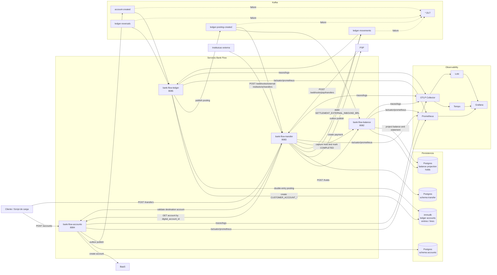

# Bank Flow Backend

Este diretorio contem quatro servicos Spring Boot para abertura de contas digitais, transferencias, ledger contabil e projecao de saldo.

Regra de identificadores: `accounts`, `transfer` e `balance` usam somente `digital_account_id`. Apenas o `ledger` manipula o `account_id` numerico contabil.

## Servicos

| Servico | Porta | Responsabilidade |
| --- | --- | --- |
| `bank-flow-accounts` | `8084` | Cria contas digitais, chama BaaS e publica `account-created`. |
| `bank-flow-transfer` | `8083` | Orquestra hold, PSP, webhook inbound externo, outbox para ledger e conclusao. |
| `bank-flow-ledger` | `8085` | Mantem double-entry no immudb e publica `ledger-posting-created`. |
| `bank-flow-balance` | `8082` | Projeta saldos/extratos e gerencia holds por `digital_account_id`. |

## Arquitetura



## Fluxo Principal

Criacao de conta:

```text
POST /accounts
  -> accounts chama BaaS
  -> accounts salva branch/account
  -> accounts publica account-created via outbox
  -> ledger cria ledger account interno para o digital_account_id
```

Transferencia:

```text
POST /transfers
  -> transfer consulta accounts por digital_account_id
  -> transfer cria hold no balance
  -> transfer chama PSP
  -> webhook PSP CONFIRMED
  -> transfer publica ledger-movements via outbox
  -> ledger cria posting double-entry
  -> ledger publica ledger-posting-created
  -> balance projeta saldo/extrato
  -> transfer captura hold e marca COMPLETED
```

Se o PSP retorna `FAILED`, o transfer libera o hold e marca a transferencia como `FAILED`.

Transferencia inbound de outra instituicao:

```text
POST /webhooks/external-institutions/transfers
  -> transfer valida a conta destino no accounts
  -> usa a conta contabil de liquidacao como origem
  -> transfer publica ledger-movements via outbox
  -> ledger debita liquidacao e credita a conta destino
  -> balance projeta saldo/extrato
  -> transfer marca COMPLETED apos ledger-posting-created
```

## Kafka

| Topico | Produtor | Consumidor | Chave |
| --- | --- | --- | --- |
| `account-created` | accounts | ledger | `digital_account_id` |
| `ledger-movements` | transfer | ledger | `source_digital_account_id` |
| `ledger-reversals` | externo/scripts | ledger | `original_external_id` |
| `ledger-posting-created` | ledger | balance, transfer | `external_id` |

Cada topico possui DLT com sufixo `.DLT`.

Conta contabil de liquidacao inbound:

```text
account_code: SETTLEMENT_EXTERNAL_INBOUND_BRL
owner_id: 00000000-0000-0000-0000-000000000100
```

Antes de processar inbound externo em ambiente novo, rode o seed em `scripts/immudb/002_seed_settlement_accounts.sql`.

## Infra Local

Suba dependencias principais:

```bash
docker compose up -d db kafka kafka-init kafka-ui immudb
```

Servicos:

- Postgres: `localhost:5432`, database `bank_flow`, user `myuser`, password `mysecretpassword`
- Kafka: `localhost:9092`
- Kafka UI: `http://localhost:8081`
- immudb: `localhost:3322`

## Rodando Aplicacoes

Em terminais separados:

```bash
cd bank-flow-accounts && ./gradlew bootRun
cd bank-flow-balance && ./gradlew bootRun
cd bank-flow-ledger && ./gradlew bootRun
cd bank-flow-transfer && ./gradlew bootRun
```

## Observability

Suba a stack:

```bash
docker compose -f docker-compose.observability.yml up -d
```

URLs:

- Grafana: `http://localhost:3000` (`admin`/`admin`)
- Prometheus: `http://localhost:9090`
- Loki: `http://localhost:3100`
- Tempo: `http://localhost:3200`

Todos os servicos expõem:

```text
/actuator/health
/actuator/metrics
/actuator/prometheus
```

Tempo recebe traces via OTLP em `localhost:4318/v1/traces`. O service graph usa métricas geradas pelo Tempo e enviadas ao Prometheus via remote write.

Metricas de negocio criticas:

- `accounts_in_status` e `account_oldest_in_status_age_seconds`
- `transfers_in_status` e `transfer_oldest_in_status_age_seconds`
- `transfer_end_to_end_latency_seconds`
- `outbox_pending_events` e `outbox_oldest_pending_event_age_seconds`
- `ledger_posting_created_total`, `ledger_publish_failures_total` e `ledger_posting_unbalanced_total`
- `balance_projection_lag_seconds`, `bank_flow_balance_projection_total` e `balance_hold_close_failures_total`

## Script de Carga

O script abaixo cria contas, envia uma transferencia inbound externa para uma conta criada na propria execucao, faz funding inicial pela conta seed e mantém transferencias contínuas entre as contas. Ele também cria novas contas aleatoriamente durante o loop.

```bash
python3 scripts/orchestrate_accounts_transfers.py \
  --accounts 3 \
  --seed-amount-minor 10000 \
  --between-min-amount-minor 50 \
  --between-max-amount-minor 500 \
  --account-create-rate 0.2 \
  --between-decline-rate 0.2
```

Conta seed padrao:

```text
3f20291f-c0ba-4c8e-b0b2-7ff1cccb3833
```

Use `Ctrl+C` para parar. Para uma execucao finita:

```bash
python3 scripts/orchestrate_accounts_transfers.py --max-between-transfers 10 --max-created-accounts 5
```

Opcoes relacionadas ao inbound externo:

```bash
python3 scripts/orchestrate_accounts_transfers.py \
  --external-inbound-amount-minor 750

python3 scripts/orchestrate_accounts_transfers.py \
  --skip-external-inbound
```

## GitHub Actions

Workflow principal: `.github/workflows/pipeline.yaml`.

Ele pode ser executado manualmente com `workflow_dispatch` escolhendo:

- `all`
- `accounts`
- `balance`
- `transfer`
- `ledger`

Cada servico tambem possui um workflow proprio que roda `./gradlew test` no diretorio correspondente.

## Testes

```bash
cd bank-flow-accounts && ./gradlew test
cd ../bank-flow-transfer && ./gradlew test
cd ../bank-flow-ledger && ./gradlew test
cd ../bank-flow-balance && ./gradlew test
```

## Bancos

- `bank-flow-accounts`: schema Postgres `accounts`.
- `bank-flow-transfer`: schema Postgres `transfer`.
- `bank-flow-balance`: tabelas de projecao e holds no Postgres.
- `bank-flow-ledger`: immudb para contas contabeis, entries e lines.
