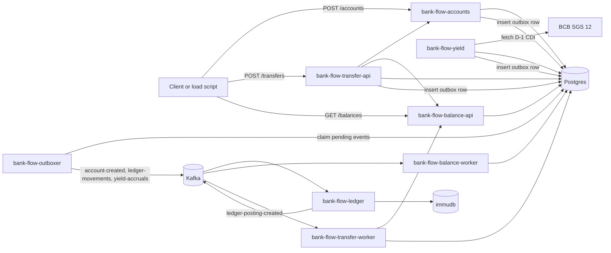

# Bank Flow Backend

Bank Flow is a study project for a banking backend built with Spring Boot, Kafka, Postgres and immudb. The repository models account opening, transfers, double-entry ledger posting, balance projection and a centralized transactional outbox publisher.

The project is intended to be open source. New contributors should be able to run the stack locally, understand each service boundary and submit focused changes without reverse-engineering the whole codebase.

## Repository Status

This is not production banking software. It is a learning and architecture project. Treat APIs, schemas and event contracts as evolving unless they are explicitly documented as stable.

Before publishing this repository publicly, add a license file and any project governance files you want to enforce, such as `CONTRIBUTING.md` and `CODE_OF_CONDUCT.md`.

## Services

| Service | Runtime | Port | Main responsibility |
| --- | --- | --- | --- |
| `bank-flow-accounts` | Spring Boot | `8084` | Creates digital accounts and records `account-created` events in the central outbox. |
| `bank-flow-outboxer` | Spring Boot | `8088` | Publishes pending outbox events from Postgres to Kafka. |
| `bank-flow-yield` | Spring Boot | `8089` | Closes D-1 CDI yield, stores the rate used and records yield accrual events in the central outbox. |
| `bank-flow-transfer-api` | Spring Boot | `8083` | Receives transfer requests, PSP webhooks and external inbound transfer webhooks. |
| `bank-flow-transfer-worker` | Spring Boot | `8086` | Consumes ledger posting confirmations and completes transfers after ledger posting. |
| `bank-flow-ledger` | Spring Boot | `8085` | Maintains double-entry ledger state in immudb and publishes posting events. |
| `bank-flow-balance-api` | Spring Boot | `8082` | Exposes balances, statements and account holds. |
| `bank-flow-balance-worker` | Spring Boot | `8087` | Projects ledger postings into balances and statements. |

Only `bank-flow-ledger` owns the numeric accounting `account_id`. Public APIs and cross-service contracts use `digital_account_id`.

## Architecture



The outbox pattern is centralized:

- Producer services write business data and an outbox row in the same Postgres transaction.
- `bank-flow-outboxer` is the only service that claims outbox rows and publishes to Kafka.
- Existing producer services no longer run local outbox publishers.

## Event Topics

| Topic | Producer | Consumers | Key |
| --- | --- | --- | --- |
| `account-created` | `bank-flow-outboxer`, from accounts outbox rows | `bank-flow-ledger` | `digital_account_id` |
| `ledger-movements` | `bank-flow-outboxer`, from transfer outbox rows | `bank-flow-ledger` | `source_digital_account_id` |
| `ledger-reversals` | external scripts or tools | `bank-flow-ledger` | `original_external_id` |
| `yield-accruals` | `bank-flow-outboxer`, from yield outbox rows | `bank-flow-ledger` | `digital_account_id` |
| `ledger-posting-created` | `bank-flow-ledger` | `bank-flow-balance-worker`, `bank-flow-transfer-worker` | `external_id` |

Kafka topics are created by the `kafka-init` service in `docker-compose.yaml`. Each main topic has a `.DLT` companion topic.

## Local Requirements

- Java 21
- Docker and Docker Compose
- Bash-compatible shell
- Optional: Python 3 for load scripts
- Optional: k6 for HTTP load tests
- Optional: Helm and Minikube for Kubernetes work

Each Spring project ships its own Gradle wrapper, so a system Gradle installation is not required.

## Start Dependencies

From the repository root:

```bash
docker compose up -d db kafka kafka-init kafka-ui immudb
```

The Makefile also exposes shortcuts for local and Kubernetes workflows:

```bash
make compose-up          # build images and start infra + apps with Docker Compose
make compose-up-infra    # start only Postgres, Kafka, Kafka UI and immudb
make k8s-deploy          # build images, load them into Minikube and apply manifests with kubectl
make k8s-status          # show pods, services, HPA, PDB and KEDA ScaledObjects
make k6-smoke            # short low-rate E2E k6 smoke test
make k6-heavy            # heavy E2E k6 load test
```

Local endpoints:

| Component | URL or address |
| --- | --- |
| Postgres | `localhost:5432`, database `bank_flow`, user `myuser`, password `mysecretpassword` |
| Kafka | `localhost:9092` |
| Kafka UI | `http://localhost:8081` |
| immudb | `localhost:3322` |

## Run The Applications

Run each command in a separate terminal:

```bash
cd bank-flow-outboxer && ./gradlew bootRun
cd bank-flow-yield && ./gradlew bootRun
cd bank-flow-accounts && ./gradlew bootRun
cd bank-flow-ledger && ./gradlew bootRun
cd bank-flow-balance && ./gradlew :api:bootRun
cd bank-flow-balance && ./gradlew :worker:bootRun
cd bank-flow-transfer && ./gradlew :api:bootRun
cd bank-flow-transfer && ./gradlew :worker:bootRun
```

Start `bank-flow-outboxer` before creating accounts or transfers in a fresh database, because it owns the `outboxer.outbox_events` table migration.

## Smoke Test

Create an account:

```bash
curl -s -X POST http://localhost:8084/accounts \
  -H "Content-Type: application/json" \
  -H "Idempotency-Key: account-001" \
  -d '{
    "fullName": "Maria Silva",
    "documentNumber": "35225454860",
    "email": "maria@example.com",
    "motherName": "Ana Silva",
    "socialName": "Maria",
    "phoneNumber": "+5511999999999",
    "birthDate": "18-12-1996",
    "address": "Rua Teste, 123",
    "isPoliticallyExposed": false
  }'
```

Query a balance:

```bash
curl -s http://localhost:8082/balances/{digital_account_id}
```

For end-to-end traffic, use:

```bash
python3 scripts/orchestrate_accounts_transfers.py --accounts 3 --max-between-transfers 10
```

## Tests

Run all currently documented service tests:

```bash
cd bank-flow-accounts && ./gradlew test
cd ../bank-flow-outboxer && ./gradlew test
cd ../bank-flow-yield && ./gradlew test
cd ../bank-flow-ledger && ./gradlew test
cd ../bank-flow-balance && ./gradlew test
cd ../bank-flow-transfer && ./gradlew test
```

Some integration tests may require Docker because they use external infrastructure or Testcontainers.

## Project Layout

```text
bank-flow-accounts/    Account API and account outbox producer
bank-flow-outboxer/    Central outbox publisher
bank-flow-yield/       CDI yield service
bank-flow-transfer/    Transfer API, worker and shared module
bank-flow-ledger/      Accounting ledger service
bank-flow-balance/     Balance API, worker and shared module
docs/                  Architecture notes and deployment learnings
scripts/               Local orchestration, load tests and immudb setup helpers
observability/         Prometheus, Grafana, Loki and Tempo configs
kong-configs/          Gateway examples
```

## Kubernetes

Each deployable service has a Helm chart under its service directory.

Example:

```bash
helm upgrade --install bank-flow-accounts bank-flow-accounts/k8s
helm upgrade --install bank-flow-outboxer bank-flow-outboxer/k8s
helm upgrade --install bank-flow-yield bank-flow-yield/k8s
helm upgrade --install bank-flow-balance bank-flow-balance/k8s
helm upgrade --install bank-flow-ledger bank-flow-ledger/k8s
helm upgrade --install bank-flow-transfer bank-flow-transfer/k8s
```

Kubernetes and observability notes live in:

- [docs/deploy-kubernetes-minikube.md](docs/deploy-kubernetes-minikube.md)
- [docs/kubernetes-autoscaling-disruption.md](docs/kubernetes-autoscaling-disruption.md)
- [docs/aprendizados-deploy-kubernetes-minikube.md](docs/aprendizados-deploy-kubernetes-minikube.md)
- [docs/aprendizados-kubernetes-observabilidade.md](docs/aprendizados-kubernetes-observabilidade.md)

## Observability

Run the local observability stack:

```bash
docker compose -f docker-compose.observability.yml up -d
```

| Tool | URL |
| --- | --- |
| Grafana | `http://localhost:3000` |
| Prometheus | `http://localhost:9090` |
| Loki | `http://localhost:3100` |
| Tempo | `http://localhost:3200` |

Deploy dashboards from each service-owned `dashboards/` directory:

```bash
scripts/grafana/deploy_dashboards.sh
```

Defaults:

```text
GRAFANA_URL=http://localhost:3000
GRAFANA_USER=admin
GRAFANA_PASSWORD=AuroraRomeu12@
```

You can use `GRAFANA_TOKEN` instead of user/password. Dashboards provisioned by
Grafana files are left in place; the script deploys service-owned dashboards via
the Grafana API.

All Spring services expose:

```text
/actuator/health
/actuator/metrics
/actuator/prometheus
```

## Contributing

Contributions are welcome. Keep pull requests small, explain the behavior change, and include tests for non-trivial logic.

Recommended workflow:

1. Create or pick an issue.
2. Run the affected service locally.
3. Add or update tests close to the changed code.
4. Run the relevant Gradle test task.
5. Update README or docs when contracts, setup or operations change.

Engineering conventions:

- Preserve service ownership boundaries.
- Keep public contracts based on `digital_account_id`.
- Keep outbox publishing centralized in `bank-flow-outboxer`.
- Prefer idempotent consumers and deterministic keys.
- Do not mix unrelated refactors into behavior changes.

## More Documentation

- [docs/fluxos-regras-validacoes.md](docs/fluxos-regras-validacoes.md)
- [bank-flow-accounts/README.md](bank-flow-accounts/README.md)
- [bank-flow-outboxer/README.md](bank-flow-outboxer/README.md)
- [bank-flow-transfer/README.md](bank-flow-transfer/README.md)
- [bank-flow-ledger/README.md](bank-flow-ledger/README.md)
- [bank-flow-balance/README.md](bank-flow-balance/README.md)
