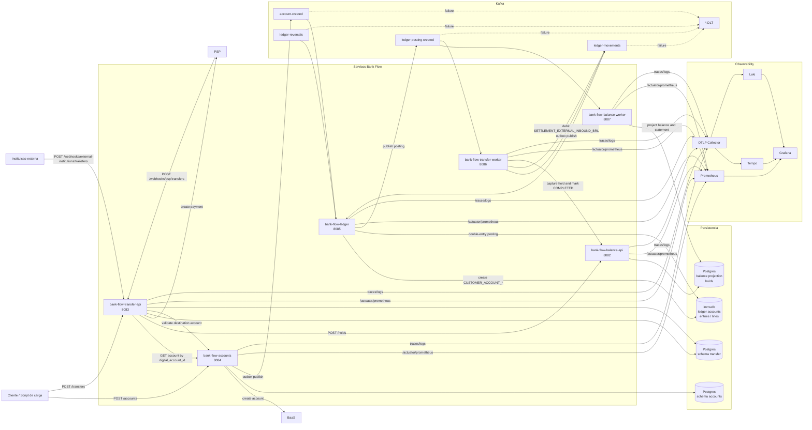

# Bank Flow Backend

Este diretorio contem os servicos Spring Boot para abertura de contas digitais, transferencias, ledger contabil e projecao de saldo. O dominio de transferencias e dividido em API HTTP e Worker.

Regra de identificadores: `accounts`, `transfer` e `balance` usam somente `digital_account_id`. Apenas o `ledger` manipula o `account_id` numerico contabil.

Fluxos completos, regras de negocio e validacoes estao documentados em [docs/fluxos-regras-validacoes.md](docs/fluxos-regras-validacoes.md).

## Servicos

| Servico | Porta | Responsabilidade |
| --- | --- | --- |
| `bank-flow-accounts` | `8084` | Cria contas digitais, chama BaaS e publica `account-created`. |
| `bank-flow-transfer-api` | `8083` | API HTTP de transferencias, PSP webhook e inbound externo. |
| `bank-flow-transfer-worker` | `8086` | Publica outbox para Kafka, consome `ledger-posting-created` e conclui transferencias. |
| `bank-flow-ledger` | `8085` | Mantem double-entry no immudb e publica `ledger-posting-created`. |
| `bank-flow-balance-api` | `8082` | API HTTP de saldo, extrato e holds por `digital_account_id`. |
| `bank-flow-balance-worker` | `8087` | Consome `ledger-posting-created`, projeta saldo/extrato e expira holds. |

## Arquitetura



## Fluxo Principal

Criacao de conta:

```text
POST /accounts
  -> accounts chama BaaS
  -> accounts salva branch/account
  -> accounts publica account-created via outbox
  -> ledger cria ledger account interno para o digital_account_id
```

Transferencia:

```text
POST /transfers
  -> transfer-api consulta accounts por digital_account_id
  -> transfer-api cria hold no balance
  -> transfer-api chama PSP
  -> webhook PSP CONFIRMED
  -> transfer-api grava ledger-movements no outbox
  -> transfer-worker publica ledger-movements
  -> ledger cria posting double-entry
  -> ledger publica ledger-posting-created
  -> balance-worker projeta saldo/extrato
  -> transfer-worker captura hold e marca COMPLETED
```

Se o PSP retorna `FAILED`, o transfer-api libera o hold e marca a transferencia como `FAILED`.

Transferencia inbound de outra instituicao:

```text
POST /webhooks/external-institutions/transfers
  -> transfer-api valida a conta destino no accounts
  -> usa a conta contabil de liquidacao como origem
  -> transfer-api grava ledger-movements no outbox
  -> transfer-worker publica ledger-movements
  -> ledger debita liquidacao e credita a conta destino
  -> balance-worker projeta saldo/extrato
  -> transfer-worker marca COMPLETED apos ledger-posting-created
```

## Kafka

| Topico | Produtor | Consumidor | Chave |
| --- | --- | --- | --- |
| `account-created` | accounts | ledger | `digital_account_id` |
| `ledger-movements` | transfer-worker | ledger | `source_digital_account_id` |
| `ledger-reversals` | externo/scripts | ledger | `original_external_id` |
| `ledger-posting-created` | ledger | balance-worker, transfer-worker | `external_id` |

Cada topico possui DLT com sufixo `.DLT`.

Conta contabil de liquidacao inbound:

```text
account_code: SETTLEMENT_EXTERNAL_INBOUND_BRL
owner_id: 00000000-0000-0000-0000-000000000100
```

Antes de processar inbound externo em ambiente novo, rode o seed em `scripts/immudb/002_seed_settlement_accounts.sql`.

## Infra Local

Suba dependencias principais:

```bash
docker compose up -d db kafka kafka-init kafka-ui immudb
```

Servicos:

- Postgres: `localhost:5432`, database `bank_flow`, user `myuser`, password `mysecretpassword`
- Kafka: `localhost:9092`
- Kafka UI: `http://localhost:8081`
- immudb: `localhost:3322`

## Rodando Aplicacoes

Em terminais separados:

```bash
cd bank-flow-accounts && ./gradlew bootRun
cd bank-flow-balance && ./gradlew :api:bootRun
cd bank-flow-balance && ./gradlew :worker:bootRun
cd bank-flow-ledger && ./gradlew bootRun
cd bank-flow-transfer && ./gradlew :api:bootRun
cd bank-flow-transfer && ./gradlew :worker:bootRun
```

## Kubernetes

Cada servico possui um chart Helm proprio em `k8s/`, permitindo deploy individualizado:

```bash
helm upgrade --install bank-flow-accounts bank-flow-accounts/k8s
helm upgrade --install bank-flow-balance bank-flow-balance/k8s
helm upgrade --install bank-flow-ledger bank-flow-ledger/k8s
helm upgrade --install bank-flow-transfer bank-flow-transfer/k8s
```

Recursos criados por servico:

- `ConfigMap`: variaveis de ambiente nao sensiveis, definidas em `values.yaml`.
- `Secret`: credenciais de Postgres ou immudb, definidas em `values.yaml`.
- `Deployment`: container, replicas, probes de liveness/readiness e recursos.
- `Service`: exposicao interna `ClusterIP`.

Observacao: `bank-flow-ledger` usa `StatefulSet`, nao `Deployment`, para manter nomes de pods estaveis. O app deriva `ID_GENERATOR_WORKER_ID` do ordinal do pod, por exemplo `bank-flow-ledger-0` usa worker `0`.

As imagens padrao usam `bank-flow-<servico>:local`, adequadas para Minikube com imagens carregadas localmente. Para trocar imagem/tag:

```bash
helm upgrade --install bank-flow-transfer bank-flow-transfer/k8s \
  --set components.api.image.repository=ghcr.io/bayerleindev/bank-flow-transfer-api \
  --set components.api.image.tag=<tag> \
  --set components.worker.image.repository=ghcr.io/bayerleindev/bank-flow-transfer-worker \
  --set components.worker.image.tag=<tag>
```

Para alterar replicas ou fazer deploy de apenas um modulo:

```bash
helm upgrade --install bank-flow-transfer bank-flow-transfer/k8s \
  --set components.api.replicaCount=2 \
  --set components.worker.enabled=false
```

Para escalar o ledger:

```bash
helm upgrade --install bank-flow-ledger bank-flow-ledger/k8s \
  --set replicaCount=2
```

Mantenha no maximo 100 replicas do ledger, porque o `worker_id` aceito vai de `0` a `99`.

Defaults atuais para Minikube:

- Postgres acessivel em `host.minikube.internal:5432`.
- Kafka acessivel em `host.docker.internal:9094`.
- immudb acessivel em `host.docker.internal:3322`.
- OTLP Collector acessivel em `host.minikube.internal:4318`.

### Prometheus no Kubernetes

Para métricas dentro do Minikube, use o `kube-prometheus-stack`:

```bash
helm repo add prometheus-community https://prometheus-community.github.io/helm-charts
helm repo update

helm upgrade --install monitoring prometheus-community/kube-prometheus-stack \
  --namespace monitoring \
  --create-namespace \
  -f observability/k8s/kube-prometheus-stack-values.yaml
```

Os charts dos servicos criam `ServiceMonitor` por padrão, com o label `release: monitoring`, e expõem `/actuator/prometheus` pela porta `http`.

```bash
helm upgrade --install bank-flow-accounts bank-flow-accounts/k8s
helm upgrade --install bank-flow-balance bank-flow-balance/k8s
helm upgrade --install bank-flow-ledger bank-flow-ledger/k8s
helm upgrade --install bank-flow-transfer bank-flow-transfer/k8s
```

Para os paineis de health que usam `probe_success{job="bank-flow-health"}`, instale tambem o Blackbox Exporter:

```bash
helm upgrade --install prometheus-blackbox-exporter prometheus-community/prometheus-blackbox-exporter \
  --namespace monitoring
```

Os charts criam `Probe` por padrao, tambem com o label `release: monitoring`, apontando para o `/actuator/health` do respectivo servico:

```text
http://bank-flow-accounts.<namespace>.svc:8084/actuator/health
http://bank-flow-balance-api.<namespace>.svc:8082/actuator/health
http://bank-flow-balance-worker.<namespace>.svc:8087/actuator/health
http://bank-flow-ledger.<namespace>.svc:8085/actuator/health
http://bank-flow-transfer-api.<namespace>.svc:8083/actuator/health
http://bank-flow-transfer-worker.<namespace>.svc:8086/actuator/health
```

Se o Blackbox Exporter tiver outro nome ou namespace, ajuste o endereco do prober:

```bash
helm upgrade --install bank-flow-ledger bank-flow-ledger/k8s \
  --set probe.proberUrl=<blackbox-service>.<namespace>.svc:9115
```

Para logs e traces, adicione os charts da Grafana:

```bash
helm repo add grafana https://grafana.github.io/helm-charts
helm repo update

helm upgrade --install loki grafana/loki \
  --namespace monitoring \
  -f observability/k8s/loki-values.yaml

helm upgrade --install alloy grafana/alloy \
  --namespace monitoring \
  -f observability/k8s/alloy-values.yaml

helm upgrade --install tempo grafana/tempo \
  --namespace monitoring \
  -f observability/k8s/tempo-values.yaml
```

O Alloy roda como `DaemonSet`, descobre pods no Kubernetes, processa logs CRI, extrai campos JSON dos logs estruturados e envia para o Loki.

Os servicos enviam traces para `http://tempo.monitoring.svc.cluster.local:4318/v1/traces` por padrao nos charts Kubernetes.

Para importar os dashboards existentes no Grafana do cluster:

```bash
kubectl create configmap bank-flow-dashboards \
  -n monitoring \
  --from-file=observability/grafana/dashboards \
  --dry-run=client -o yaml | kubectl apply -f -

kubectl label configmap bank-flow-dashboards \
  -n monitoring \
  grafana_dashboard=1 \
  --overwrite
```

Para acessar o Grafana do stack:

```bash
kubectl port-forward -n monitoring svc/monitoring-grafana 3000:80
```

## Observability

Suba a stack:

```bash
docker compose -f docker-compose.observability.yml up -d
```

URLs:

- Grafana: `http://localhost:3000` (`admin`/`admin`)
- Prometheus: `http://localhost:9090`
- Loki: `http://localhost:3100`
- Tempo: `http://localhost:3200`

Todos os servicos expõem:

```text
/actuator/health
/actuator/metrics
/actuator/prometheus
```

Tempo recebe traces via OTLP em `localhost:4318/v1/traces`. O service graph usa métricas geradas pelo Tempo e enviadas ao Prometheus via remote write.

Aprendizados do setup Kubernetes/observabilidade estao em [docs/aprendizados-kubernetes-observabilidade.md](docs/aprendizados-kubernetes-observabilidade.md).

Passo a passo operacional para deploy no Minikube esta em [docs/deploy-kubernetes-minikube.md](docs/deploy-kubernetes-minikube.md).

Aprendizados especificos do deploy no Minikube estao em [docs/aprendizados-deploy-kubernetes-minikube.md](docs/aprendizados-deploy-kubernetes-minikube.md).

Fluxos, regras de negocio e validacoes estao em [docs/fluxos-regras-validacoes.md](docs/fluxos-regras-validacoes.md).

Metricas de negocio criticas:

- `accounts_in_status` e `account_oldest_in_status_age_seconds`
- `transfers_in_status` e `transfer_oldest_in_status_age_seconds`
- `transfer_end_to_end_latency_seconds`
- `outbox_pending_events` e `outbox_oldest_pending_event_age_seconds`
- `ledger_posting_created_total`, `ledger_publish_failures_total` e `ledger_posting_unbalanced_total`
- `balance_projection_lag_seconds`, `bank_flow_balance_projection_total` e `balance_hold_close_failures_total`

## Script de Carga

O script abaixo cria contas, envia uma transferencia inbound externa para uma conta criada na propria execucao, faz funding inicial pela conta seed e mantém transferencias contínuas entre as contas. Ele também cria novas contas aleatoriamente durante o loop.

```bash
python3 scripts/orchestrate_accounts_transfers.py \
  --accounts 3 \
  --seed-amount-minor 10000 \
  --between-min-amount-minor 50 \
  --between-max-amount-minor 500 \
  --account-create-rate 0.2 \
  --between-decline-rate 0.2
```

Conta seed padrao:

```text
3f20291f-c0ba-4c8e-b0b2-7ff1cccb3833
```

Use `Ctrl+C` para parar. Para uma execucao finita:

```bash
python3 scripts/orchestrate_accounts_transfers.py --max-between-transfers 10 --max-created-accounts 5
```

Opcoes relacionadas ao inbound externo:

```bash
python3 scripts/orchestrate_accounts_transfers.py \
  --external-inbound-amount-minor 750

python3 scripts/orchestrate_accounts_transfers.py \
  --skip-external-inbound
```

## GitHub Actions

Workflow principal: `.github/workflows/pipeline.yaml`.

Ele pode ser executado manualmente com `workflow_dispatch` escolhendo:

- `all`
- `accounts`
- `balance`
- `balance-api`
- `balance-worker`
- `transfer`
- `transfer-api`
- `transfer-worker`
- `ledger`

Cada servico tambem possui um workflow proprio. Balance e transferencias tem pipelines separados para `:api` e `:worker`, alem dos workflows agregados `balance` e `transfer`.

## Testes

```bash
cd bank-flow-accounts && ./gradlew test
cd ../bank-flow-balance && ./gradlew test
cd ../bank-flow-balance && ./gradlew :api:test
cd ../bank-flow-balance && ./gradlew :worker:test
cd ../bank-flow-transfer && ./gradlew test
cd ../bank-flow-transfer && ./gradlew :api:test
cd ../bank-flow-transfer && ./gradlew :worker:test
cd ../bank-flow-ledger && ./gradlew test
```

## Bancos

- `bank-flow-accounts`: schema Postgres `accounts`.
- `bank-flow-transfer`: schema Postgres `transfer`.
- `bank-flow-balance`: tabelas de projecao e holds no Postgres.
- `bank-flow-ledger`: immudb para contas contabeis, entries e lines.
